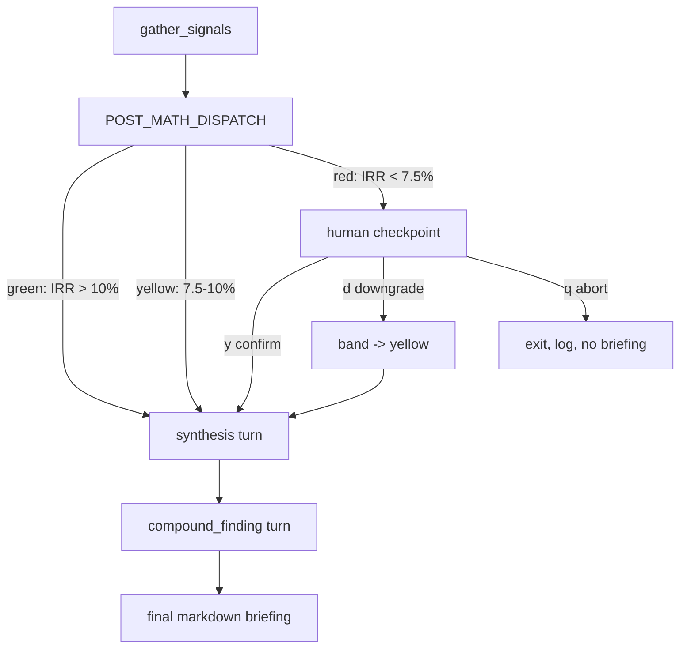

# CRE Deal Pulse — Codebase Audit (v2)

**Audit date:** 2026-05-06 (v2 implementation complete)
**Scope:** All tracked and present files in this workspace, post v2 finish plan.
**Method:** Full read of every executable, config, prompt, data, test, and documentation file; cross-check against README, CURRENT_STATE.md, and the v2 plan.

---

## Executive summary

This is now a **v2 implementation** of CRE Deal Pulse. The repo orchestrates **seven tools** (HPD violations, ACRIS sales, ACRIS-style leasing comps, FRED rates, deterministic underwriting, POST_MATH_DISPATCH band classifier, snapshot diff), routes the deal through a **deterministic dispatch node** that classifies on absolute observed IRR, **pauses on red-band deals at a three-outcome human checkpoint** (confirm / downgrade / abort), then runs **two LLM turns** (synthesis + cross-signal compound_finding) via **Strands + LiteLLM**.

**Strengths**

- The model no longer scores severity. The dispatch tool is the load-bearing materiality signal — clean, testable, deterministic.
- Three-outcome checkpoint with full audit log in `runs/`.
- Synthesis prompt branches tone on edge_label (auto_render / advisory / requires_human_review); compound_finding has hard guardrails (≥2 named signals + snapshot_diff anchor or empty-state line).
- Hermetic pytest suite (58 tests) covers band boundaries, fallback chain, checkpoint state machine, audit log, and the green / yellow / red + confirm / downgrade / abort end-to-end paths.
- `MODEL_ID` env var; `test_model.py` honors the same var.
- Defensive `_safe_rel` so logs don't crash when paths live outside REPO_ROOT.

**Known caveats / follow-ups**

- Claude live verification is the user's step (no API keys in this environment).
- System Python may be 3.9 in some shells; project requires 3.10+ (per `requirements.txt`).
- Snapshot dates use UTC — analysts in non-UTC timezones see "today" roll over at a different local time. Documented in README "Known model behaviors."
- Demo deal still hits ~11% observed IRR on the killer-quote (green by absolute level). Demo tuning to force a red-band run is flagged as an open sub-decision in the v2 finish plan.
- `.tools/env` contains an absolute path from another developer's machine. Not secret, not portable. Pre-existing chore-tier.

---

## File inventory (v2)

| Path | Role | Notes |
|------|------|-------|
| `agent.py` | Main entry | gather → dispatch → checkpoint (if red) → synthesis → compound_finding. Three-outcome state machine. |
| `tools/violations.py` | Tool 1 | NYC HPD API (unchanged) |
| `tools/market_signals.py` | Tool 2 | NYC ACRIS sales (unchanged) |
| `tools/leasing_comps.py` | Tool 7 [v2] | CLI override → CSV (SF-weighted) → demo_observations → unavailable |
| `tools/macro_signals.py` | Tool 3 | FRED 10Y + SOFR (unchanged) |
| `tools/underwriting.py` | Tool 4 | DCF + Newton's IRR. `_severity_from_irr_delta` retained for back-compat but not load-bearing. |
| `tools/dispatch.py` | Tool 6 [v2] | POST_MATH_DISPATCH band classifier. Bands on absolute IRR. Fail-safe red. |
| `tools/snapshot_diff.py` | Tool 5 | Generic walker (unchanged; absorbs new dispatch + leasing_comps top-level keys automatically) |
| `prompts/system_prompt_v2.txt` | Prompt | Synthesis-only. No severity scoring. |
| `prompts/compound_finding.txt` | Prompt [v2] | Cross-signal turn with hard cite-≥2 guardrail |
| `tests/conftest.py` | Test infra [v2] | Strands stub, fake_requests fixture, tmp dirs, demo_deal |
| `tests/test_dispatch.py` | Tests [v2] | 18 cases — boundaries 10.0/7.5/7.49, fail-safes, IRR echo |
| `tests/test_leasing_comps.py` | Tests [v2] | 8 cases — full fallback chain |
| `tests/test_checkpoint.py` | Tests [v2] | 25 cases — interpret_input matrix, downgrade immutability, audit log fields |
| `tests/test_run_loop.py` | Tests [v2] | 6 integration — green/yellow skip, red+confirm/downgrade/abort, snapshot includes dispatch |
| `deals/midtown-south-office-001.json` | Demo deal | Unchanged |
| `scripts/record_demo.sh` | Demo helper | Unchanged |
| `test_model.py` | LLM smoke test | Updated to honor `MODEL_ID` |
| `requirements.txt` | Deps | Adds `pytest>=8.0.0` |
| `.env.example` | Template | Adds Claude swap notes (commented) |
| `.gitignore` | Git | Unchanged |
| `README.md` | Docs | Rewritten for v2 |
| `CURRENT_STATE.md` | Internal docs | Refreshed §3, §4, §6, §7, §8, §9 |
| `CODEBASE_AUDIT.md` | Internal docs | This file |

**Runtime / gitignored:** `runs/` (checkpoint logs), `snapshots/` (daily JSON), `.venv/`, `.env`.

---

## Architecture (v2)

- **Edge labels**: green=`auto_render`, yellow=`advisory`, red=`requires_human_review`.
- **Stages 4–5** (synthesis + compound) are LLM-only. Checkpoint sits between dispatch (stage 3) and synthesis (stage 4). Diagram contradiction (red path needing review while stage 5 is supposed to be LLM-only) is resolved.

---

## Per-module review

### `agent.py` (v2)

- `_gather_signals` orchestrates 5 tools + dispatch + snapshot write/diff.
- `_post_math_dispatch` is the deterministic router.
- `_human_checkpoint` is a state machine; returns `confirmed | downgrade | abort`.
- `_downgrade_dispatch` is immutable (returns a copy; original snapshot untouched).
- `_synthesis_query` and `_compound_finding_query` are the only LLM calls.
- `_safe_rel` defends against `relative_to(REPO_ROOT)` raising on tmp paths.
- `_extract_json` retained for any future structured turns; not currently called.

### `tools/dispatch.py` [v2]

- 11 internal `__main__` smoke tests + 18 pytest cases. Boundary semantics locked: 10.0% and 7.5% belong to yellow.
- Fail-safe red on missing IRR, error envelope, non-dict input.

### `tools/leasing_comps.py` [v2]

- 7 internal `__main__` tests + 8 pytest cases. Resolution: override → CSV (SF-weighted) → demo_observations → unavailable.
- Malformed CSV doesn't silently mask demo data; provenance records the failure.

### `tools/underwriting.py`

- Math unchanged. `_severity_from_irr_delta` and `severity_hint` retained for back-compat one release; deprecation called out in CURRENT_STATE §8.

### `tools/snapshot_diff.py`

- Unchanged. Generic walker absorbed `dispatch` and `leasing_comps` top-level keys without code edits.

### Prompts

- `system_prompt_v2.txt`: synthesis-only, forbids 1–5 severity. ~1842 chars.
- `compound_finding.txt`: cite-≥2-signals constraint, empty-state line. ~2332 chars.

### Tests (`tests/`)

- `conftest.py`: Strands stub installed before any agent import. `fake_requests` fixture mocks HPD/ACRIS/FRED. `tmp_runs_and_snapshots` redirects writes off real disk. `demo_deal` loads the staged deal.
- 58 tests pass in &lt;1 second on a clean checkout, no network or keys.

### `test_model.py`

- Now honors `MODEL_ID`. Same default as `agent.py`.

---

## Security and compliance

| Topic | Assessment |
|--------|------------|
| Secrets in repo | `.env.example` is placeholders + commented swap notes — clean. |
| `.env` handling | Gitignored; `load_dotenv()` in `agent.py`. |
| API keys in logs | Audit logs in `runs/` capture dispatch + IRR + driver fields, no raw keys. |
| Injection / SoQL | Same as v1 — borough code is from a controlled enum, numeric bounds are validated. Deal JSON treated as trusted input. |
| Supply chain | Same loose pinning (`>=`, `<2`); pytest added with `>=8.0.0`. |

---

## Testing and quality gates

- 58 hermetic pytest cases.
- Boundary tests for the dispatch node.
- State machine tests for the checkpoint.
- End-to-end run tests for all 5 control-flow combinations.
- Per-tool `__main__` smoke tests retained for live integration spot-checks.

**Recommended additions (v3):**
- CI workflow (GitHub Actions) running `pytest tests/`.
- Property-based tests on `_irr` Newton solver.
- Live integration test gated behind a `LIVE=1` env var.

---

## Findings summary (prioritized)

1. **Live Claude verification** is still the user's step — environment couldn't run it. Configuration is in place.
2. **Demo deal tuning** for the red-band path is flagged in the v2 plan as an open sub-decision. The current killer-quote scenario lands in the green band by absolute IRR.
3. **`.tools/env` portability** — pre-existing chore. Hardcoded path to a different developer's machine. Not blocking.
4. **`_severity_from_irr_delta` deprecation** — kept for back-compat one release. Remove in v2.1 to clean up the contract.

---

## Conclusion

The v2 architecture is **complete in code, hermetically tested, and documented**. The model's role is now strictly synthesis + cross-signal reasoning; materiality is owned by the dispatch tool. The three-outcome checkpoint and the resolved diagram contradiction make the human-in-the-loop story defensible to a coach review. Remaining work for the user is the live Claude swap + transcript capture, plus the demo-deal tuning question for whether the killer-quote run should fire on absolute IRR (red band) or stay on delta magnitude (green band, narrated as a watch).
